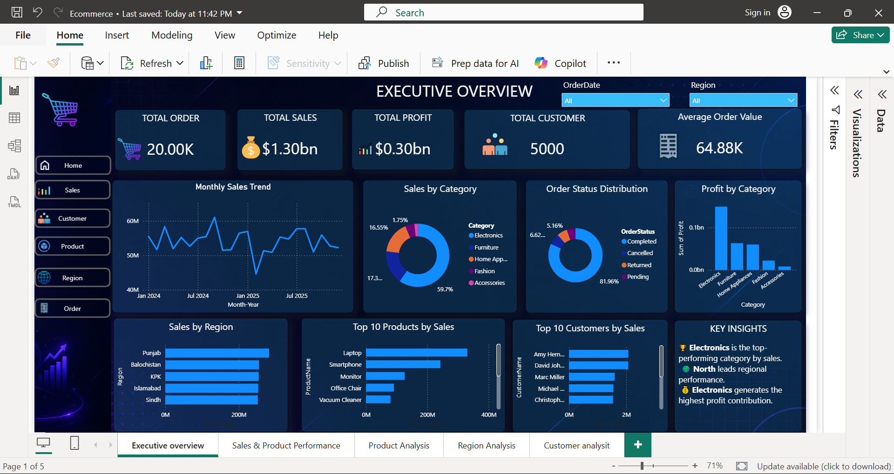
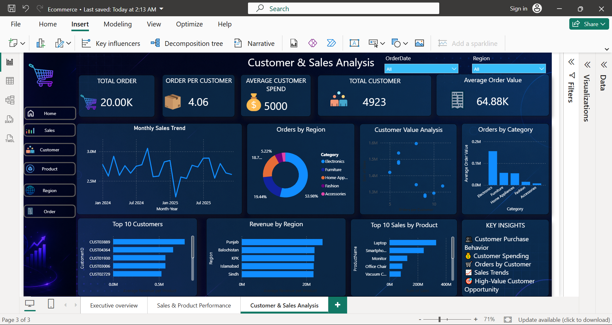
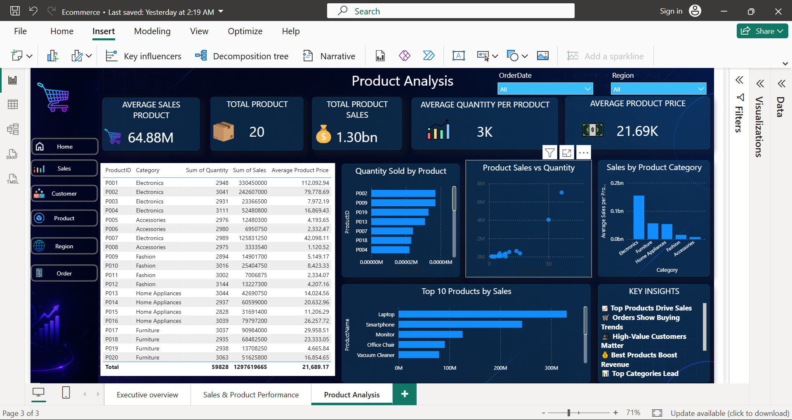
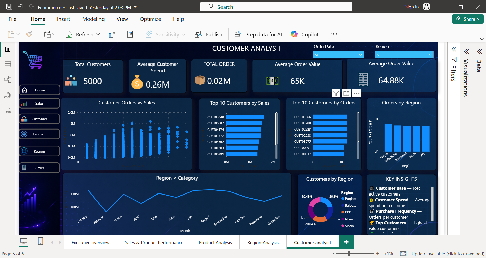
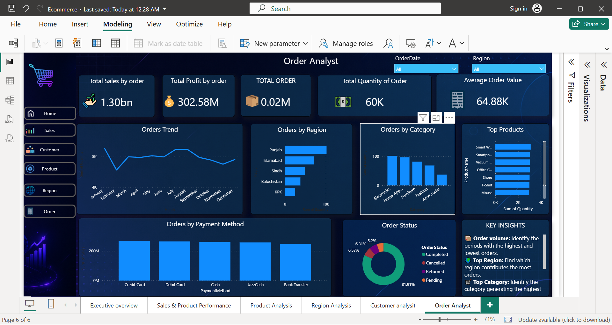

# 🛒 E-Commerce Sales & Customer Analytics Dashboard

An interactive **Power BI E-Commerce Analytics Dashboard** developed to analyze sales, profitability, customer behavior, product performance, regional performance, and order trends.

The project combines **Python, SQL, Power BI, DAX, and Power Query** to transform raw e-commerce data into interactive and business-focused insights.

---

## 📊 Project Overview

This project provides a multi-page analytical dashboard designed to help businesses monitor performance, understand customer behavior, identify high-performing products, and evaluate regional and order-level trends.

### Dashboard Pages

- Executive Overview
- Customer & Sales Analysis
- Product Analysis
- Region Analysis
- Customer Analysis
- Order Analysis

---

# 📈 Dashboard Preview

## 1. Executive Overview

The Executive Overview provides a high-level summary of overall business performance.

### Key KPIs

- Total Orders
- Total Sales
- Total Profit
- Total Customers
- Average Order Value

### Key Analysis

- Monthly Sales Trend
- Sales by Category
- Order Status Distribution
- Profit by Category
- Sales by Region
- Top 10 Products
- Top 10 Customers



---

## 2. Customer & Sales Analysis

This page focuses on customer purchasing behavior and revenue contribution.

### Key KPIs

- Total Orders
- Orders per Customer
- Average Customer Spend
- Total Customers
- Average Order Value

### Key Analysis

- Monthly Sales Trend
- Orders by Region
- Customer Value Analysis
- Orders by Category
- Top Customers
- Revenue by Region
- Top Products



---

## 3. Product Analysis

The Product Analysis page evaluates product-level sales, quantity, pricing, and category performance.

### Key KPIs

- Average Sales per Product
- Total Products
- Total Product Sales
- Average Quantity per Product
- Average Product Price

### Key Analysis

- Quantity Sold by Product
- Product Sales vs Quantity
- Sales by Product Category
- Top 10 Products by Sales
- Product-Level Performance Table



---

## 4. Region Analysis

The Region Analysis page provides insights into geographical sales and order performance.

### Key Analysis

- Sales by Region
- Orders by Region
- Regional Revenue Comparison
- Regional Category Performance
- Customer Distribution by Region
- Regional Sales Trends

---

## 5. Customer Analysis

The Customer Analysis page provides a deeper view of customer value, order frequency, and regional distribution.

### Key Analysis

- Customer Orders vs Sales
- Top 10 Customers by Sales
- Top 10 Customers by Orders
- Orders by Region
- Region × Category Analysis
- Customers by Region



---

## 6. Order Analysis

The Order Analysis page focuses on order volume, category performance, payment methods, and order status.

### Key KPIs

- Total Sales
- Total Profit
- Total Orders
- Total Quantity
- Average Order Value

### Key Analysis

- Orders Trend
- Orders by Region
- Orders by Category
- Top Products
- Orders by Payment Method
- Order Status Distribution



---

# 🛠️ Tools & Technologies

### Data Analysis
- Python
- Pandas
- Jupyter Notebook

### Database & Querying
- SQL
- MySQL

### Business Intelligence
- Microsoft Power BI
- DAX
- Power Query

### Visualization
- Interactive KPI Cards
- Bar Charts
- Line Charts
- Donut Charts
- Scatter Plots
- Tables
- Slicers
- Interactive Filters

---

# 📌 Key Business Insights

- **Electronics** is the leading product category by sales.
- **Punjab** shows strong regional sales and order performance.
- **Laptops and Smartphones** are among the highest-revenue products.
- Customer purchasing behavior varies across different regions.
- High-value customers contribute significantly to overall revenue.
- Order status analysis helps identify completed, cancelled, returned, and pending orders.
- Payment-method analysis provides insight into customer transaction preferences.
- Product-level analysis helps identify the products driving overall revenue.

---

# 🎯 Business Objectives

The dashboard was developed to help businesses:

- Monitor overall sales performance
- Track profitability
- Analyze customer purchasing behavior
- Identify high-value customers
- Evaluate product performance
- Compare regional performance
- Monitor order trends
- Analyze payment methods
- Identify revenue-driving categories
- Support data-driven business decisions

---

# 📊 Key Metrics

| Metric | Purpose |
|---|---|
| Total Sales | Measures overall revenue generated |
| Total Profit | Measures overall business profitability |
| Total Orders | Measures order volume |
| Total Customers | Measures customer base |
| Average Order Value | Measures average revenue generated per order |
| Orders per Customer | Measures customer purchase frequency |
| Average Customer Spend | Measures average customer contribution |
| Total Quantity | Measures total units sold |

---

# 🔎 Analytical Areas

### 💰 Sales Analytics
- Sales trends
- Category performance
- Regional revenue
- Average Order Value

### 👥 Customer Analytics
- Customer spending
- Customer order frequency
- Top customers
- Customer value analysis

### 📦 Product Analytics
- Product sales
- Product quantity
- Top products
- Category performance
- Product pricing

### 🌍 Regional Analytics
- Regional sales
- Regional orders
- Customer distribution
- Region × Category performance

### 🛒 Order Analytics
- Order trends
- Order status
- Payment methods
- Orders by category
- Orders by region

---

# 📂 Project Structure

```text
Ecommerce-Dataset/
│
├── images/
│   ├── executive-overview.PNG
│   ├── customer-sales-analysis.PNG
│   ├── product-analysis.PNG
│   ├── order-analysis.PNG
│   └── customer-analysis.PNG
│
├── ECOMMERCE DATASET.sql
├── ECOMMERCE DATASET.ipynb
├── Ecommerce.pbix
├── customers.csv
├── ecommerce_orders.csv
├── products.csv
│
└── README.md
