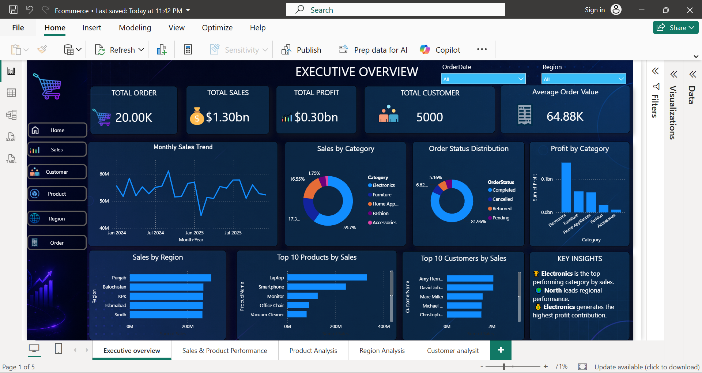
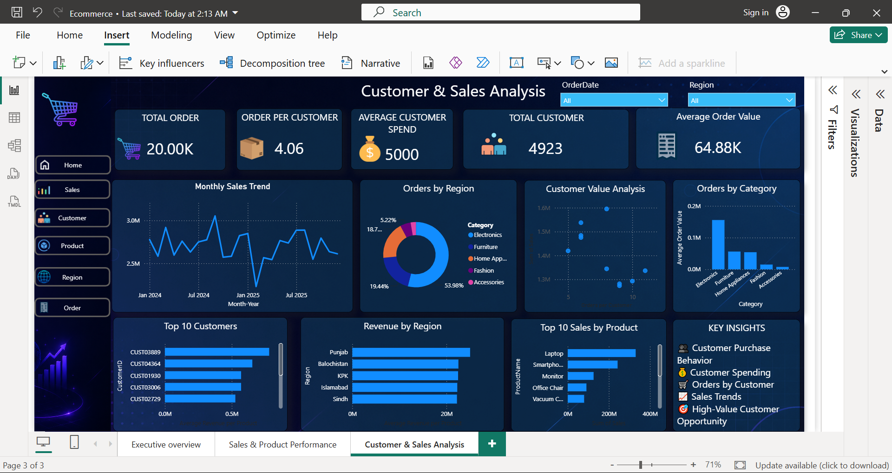
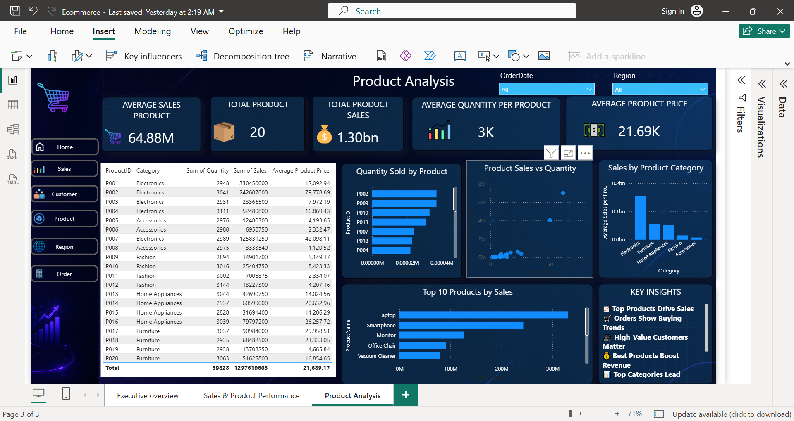
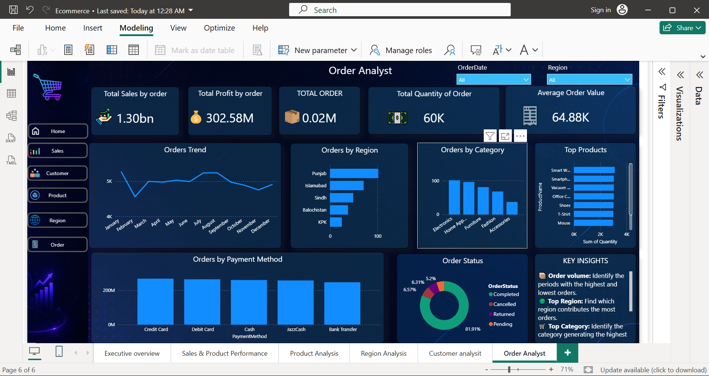
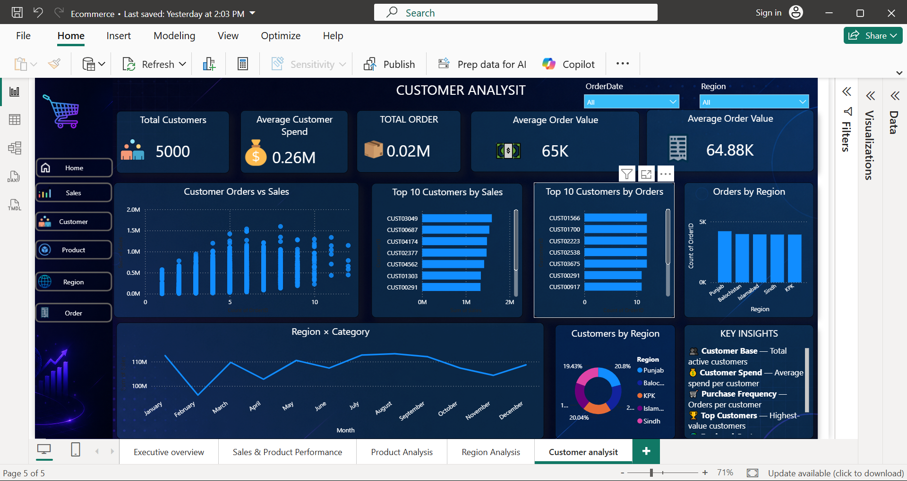

# 🛒 E-Commerce Sales & Customer Analytics Dashboard

An interactive **E-Commerce Analytics Dashboard** built with **Python, SQL, Power BI, DAX, and Power Query** to analyze sales, profitability, customer behavior, product performance, regional performance, and order trends.

The project transforms raw e-commerce data into interactive, business-focused insights that support data-driven decision making.

---

# 📊 Project Overview

This project provides a multi-page analytical dashboard designed to help businesses:

* Monitor sales performance
* Track profitability
* Understand customer behavior
* Identify high-value customers
* Analyze product performance
* Compare regional performance
* Monitor order trends
* Analyze payment methods
* Identify revenue-driving categories

---

# 📈 Dashboard Preview

## 1. Executive Overview

The Executive Overview provides a high-level view of overall business performance.

### Key KPIs

* Total Orders
* Total Sales
* Total Profit
* Total Customers
* Average Order Value

### Key Analysis

* Monthly Sales Trend
* Sales by Category
* Order Status Distribution
* Profit by Category
* Sales by Region
* Top 10 Products
* Top 10 Customers



---

## 2. Customer & Sales Analysis

This dashboard focuses on customer purchasing behavior and revenue contribution.

### Key Analysis

* Monthly Sales Trend
* Orders by Region
* Customer Value Analysis
* Orders by Category
* Top Customers
* Revenue by Region
* Top Products
* Average Customer Spend
* Orders per Customer



---

## 3. Product Analysis

The Product Analysis dashboard evaluates product-level sales, quantity, pricing, and category performance.

### Key KPIs

* Average Sales per Product
* Total Products
* Total Product Sales
* Average Quantity per Product
* Average Product Price

### Key Analysis

* Quantity Sold by Product
* Product Sales vs Quantity
* Sales by Product Category
* Top 10 Products by Sales
* Product-Level Performance



---

## 4. Order Analysis

The Order Analysis dashboard focuses on order volume, category performance, payment methods, and order status.

### Key KPIs

* Total Sales
* Total Profit
* Total Orders
* Total Quantity
* Average Order Value

### Key Analysis

* Orders Trend
* Orders by Region
* Orders by Category
* Top Products
* Orders by Payment Method
* Order Status Distribution



---

## 5. Customer Analysis

The Customer Analysis dashboard provides a deeper view of customer value, order frequency, and regional distribution.

### Key Analysis

* Customer Orders vs Sales
* Top 10 Customers by Sales
* Top 10 Customers by Orders
* Orders by Region
* Region × Category Analysis
* Customers by Region



---

# 💡 Key Business Insights

### 💰 Sales Performance

The dashboard helps identify major revenue-driving categories, products, and regions.

### 📦 Product Performance

Product-level analysis highlights the products contributing most to overall sales and quantity sold.

### 👥 Customer Behavior

Customer analysis identifies high-value customers and differences in purchasing behavior across regions.

### 🌍 Regional Performance

Regional analysis helps compare sales, orders, revenue, and customer distribution across different locations.

### 🛒 Order Behavior

Order analysis provides visibility into order trends, order status, categories, and payment methods.

### 📈 Profitability

Profit analysis helps identify which categories and products contribute most to overall business profitability.

---

# 🛠️ Tools & Technologies

### Data Analysis

* Python
* Pandas
* Jupyter Notebook

### Database & Querying

* SQL
* MySQL

### Business Intelligence

* Microsoft Power BI
* DAX
* Power Query

### Visualization

* KPI Cards
* Bar Charts
* Line Charts
* Donut Charts
* Scatter Plots
* Tables
* Slicers
* Interactive Filters

---

# 📌 Key Metrics

| Metric                 | Purpose                                 |
| ---------------------- | --------------------------------------- |
| Total Sales            | Measures overall revenue generated      |
| Total Profit           | Measures overall business profitability |
| Total Orders           | Measures order volume                   |
| Total Customers        | Measures customer base                  |
| Average Order Value    | Measures average revenue per order      |
| Orders per Customer    | Measures customer purchase frequency    |
| Average Customer Spend | Measures average customer contribution  |
| Total Quantity         | Measures total units sold               |

---

# 🔎 Analytical Areas

## 💰 Sales Analytics

* Sales trends
* Category performance
* Regional revenue
* Average Order Value

## 👥 Customer Analytics

* Customer spending
* Customer order frequency
* Top customers
* Customer value analysis

## 📦 Product Analytics

* Product sales
* Product quantity
* Top products
* Category performance
* Product pricing

## 🌍 Regional Analytics

* Regional sales
* Regional orders
* Customer distribution
* Region × Category performance

## 🛒 Order Analytics

* Order trends
* Order status
* Payment methods
* Orders by category
* Orders by region

---

# 🧰 Project Workflow

```text
Raw E-Commerce Data
        ↓
Data Cleaning & Transformation
        ↓
Python / Pandas Analysis
        ↓
SQL Data Analysis
        ↓
Power Query
        ↓
DAX Measures
        ↓
Power BI Dashboard
        ↓
Business Insights
```

---

# 📂 Project Structure

```text
Ecommerce-Dataset/
│
├── images/
│   ├── executive-overview.PNG
│   ├── customer-sales-analysis.PNG
│   ├── product-analysis.PNG
│   ├── order-analysis.PNG
│   └── customer-analysis.PNG
│
├── ECOMMERCE DATASET.sql
├── ECOMMERECE DATASET.ipynb
├── Ecommerce.pbix
│
├── customers.csv
├── ecommerce_orders.csv
├── products.csv
│
└── README.md
```

---

# 🎯 Business Objectives

The dashboard was developed to help businesses:

* Monitor overall sales performance
* Track profitability
* Analyze customer purchasing behavior
* Identify high-value customers
* Evaluate product performance
* Compare regional performance
* Monitor order trends
* Analyze payment methods
* Identify revenue-driving categories
* Support data-driven business decisions

---

# 🚀 Skills Demonstrated

**Power BI** • **DAX** • **Power Query** • **Python** • **Pandas** • **SQL** • **MySQL** • **Data Analysis** • **Data Visualization** • **Business Intelligence** • **Dashboard Design** • **Data Storytelling**

---

# 👨‍💻 Project Purpose

This project was developed as part of a **Data Analytics / Power BI portfolio** to demonstrate the ability to transform raw e-commerce data into an interactive and business-focused analytics solution.

The project combines **Python, SQL, and Power BI** to demonstrate an end-to-end data analytics workflow — from raw data preparation to business insights and interactive visualization.

---

# ⭐ Conclusion

The **E-Commerce Sales & Customer Analytics Dashboard** provides a comprehensive view of business performance across sales, customers, products, regions, and orders.

By combining multiple analytical perspectives into one Power BI solution, the dashboard makes it easier to identify trends, understand customer behavior, evaluate product performance, and support data-driven business decisions.
